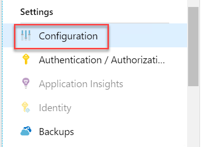
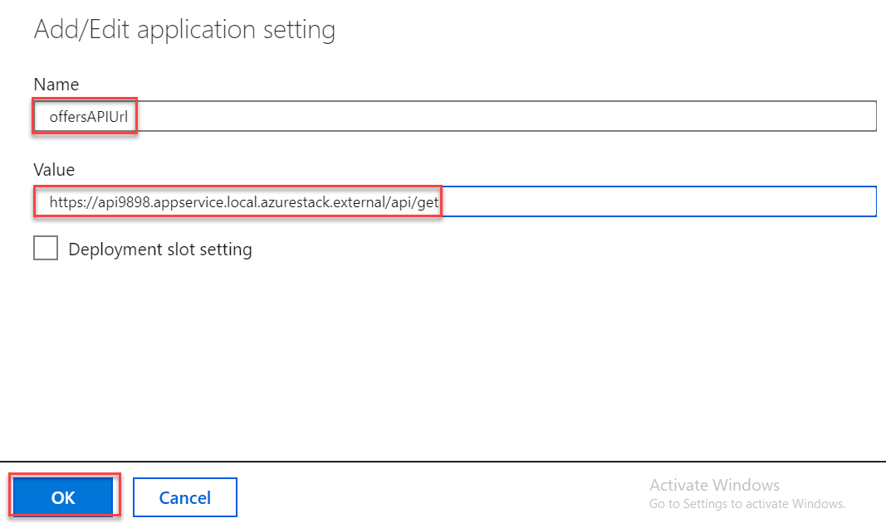
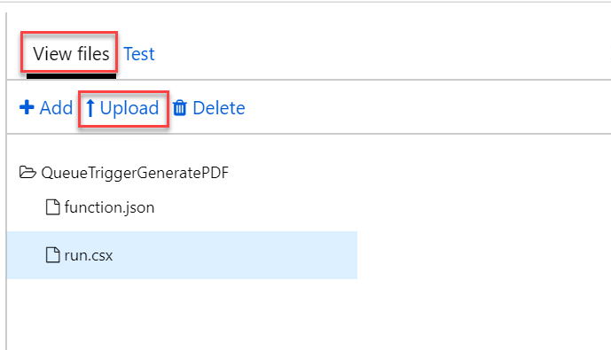

<div class="MCWHeader1">
Azure Stack Migrate
</div>

<div class="MCWHeader2">
Hands-on lab step-by-step
</div>

<div class="MCWHeader3">
July 2020
</div>

Information in this document, including URL and other Internet Web site references, is subject to change without notice. Unless otherwise noted, the example companies, organizations, products, domain names, e-mail addresses, logos, people, places, and events depicted herein are fictitious, and no association with any real company, organization, product, domain name, e-mail address, logo, person, place or event is intended or should be inferred. Complying with all applicable copyright laws is the responsibility of the user. Without limiting the rights under copyright, no part of this document may be reproduced, stored in or introduced into a retrieval system, or transmitted in any form or by any means (electronic, mechanical, photocopying, recording, or otherwise), or for any purpose, without the express written permission of Microsoft Corporation.

Microsoft may have patents, patent applications, trademarks, copyrights, or other intellectual property rights covering subject matter in this document. Except as expressly provided in any written license agreement from Microsoft, the furnishing of this document does not give you any license to these patents, trademarks, copyrights, or other intellectual property.

The names of manufacturers, products, or URLs are provided for informational purposes only and Microsoft makes no representations and warranties, either expressed, implied, or statutory, regarding these manufacturers or the use of the products with any Microsoft technologies. The inclusion of a manufacturer or product does not imply endorsement of Microsoft of the manufacturer or product. Links may be provided to third party sites. Such sites are not under the control of Microsoft and Microsoft is not responsible for the contents of any linked site or any link contained in a linked site, or any changes or updates to such sites. Microsoft is not responsible for webcasting or any other form of transmission received from any linked site. Microsoft is providing these links to you only as a convenience, and the inclusion of any link does not imply endorsement of Microsoft of the site or the products contained therein.

© 2020 Microsoft Corporation. All rights reserved.

Microsoft and the trademarks listed at https://www.microsoft.com/en-us/legal/intellectualproperty/Trademarks/Usage/General.aspx are trademarks of the Microsoft group of companies. All other trademarks are property of their respective owners.

**Contents**

<!-- TOC -->

- [Azure Stack Migrate hands-on lab step-by-step](#azure-stack-migrate-hands-on-lab-step-by-step)
    - [Abstract and learning objectives](#abstract-and-learning-objectives)
    - [Overview](#overview)
    - [Solution architecture](#solution-architecture)
    - [Help references](#help-references)
    - [Requirements](#requirements)
    - [Exercise 1: Create Azure Stack Hub Deployment Taxonomy for Tenants](#exercise-1-create-azure-stack-hub-deployment-taxonomy-for-tenants)
        - [Task 1: Create the Deployment Taxonomy](#task-1-create-the-deployment-taxonomy)
    - [Exercise 2: Deploy Contoso Financial Web Application](#exercise-2-deploy-contoso-financial-web-application)
        - [Task 1: Create the Web App](#task-1-create-the-web-app)
        - [Task 2: Provision an Azure Storage Account](#task-2-provision-an-azure-storage-account)
        - [Task 3: Deploy SQL DB on Azure Stack Hub](#task-3-deploy-sql-db-on-azure-stack-hub)
        - [Task 4: Update the configuration strings](#task-4-update-the-configuration-strings)
        - [Task 5: Publish the Contoso Financial Web Application](#task-5-publish-the-contoso-financial-web-application)
    - [Exercise 3: Deploy the customer offers Web API](#exercise-3-deploy-the-customer-offers-web-api)
        - [Task 1: Provision the offers Web API App](#task-1-provision-the-offers-web-api-app)
        - [Task 2: Deploy the Contoso.Apps.Financial.Offers project](#task-2-deploy-the-contosoappsfinancialoffers-project)
        - [Task 3: Update the Application Settings of the Web App with the API URL](#task-3-update-the-application-settings-of-the-web-app-with-the-api-url)
    - [Exercise 4: Automating backend processes with Azure functions](#exercise-4-automating-backend-processes-with-azure-functions)
        - [Task 1: Create an Azure function to generate PDF receipts](#task-1-create-an-azure-function-to-generate-pdf-receipts)
    - [Exercise 5: Deploy Contoso Finance Admin website](#exercise-5-deploy-contoso-finance-admin-website)
        - [Task 1: Provision the Contoso Finance Admin Web App](#task-1-provision-the-contoso-finance-admin-web-app)
        - [Task 2: Deploy the call center admin Web App from Visual Studio](#task-2-deploy-the-call-center-admin-web-app-from-visual-studio)
    - [After the hands-on lab](#after-the-hands-on-lab)

<!-- /TOC -->

# Azure Stack Migrate hands-on lab step-by-step

## Abstract and learning objectives

In this hands-on lab, you will deploy the Azure Stack Hub Development Kit and deploy the SQL Database and Azure App Service resource providers, as well as download several virtual machine images from the Azure Stack Hub Marketplace. From there, you will implement a full taxonomy in Azure Stack Hub consisting of a region, subscription, plan, offer, and quotas. After Azure Stack Hub is configured, you will then deploy Azure SQL Database, Web and API apps and then deploy the Contoso application.

At the end of this hands-on lab, you will be better able to deploy and manage solutions running on Azure Stack Hub.

## Overview

Contoso Finance is one of the largest banks in the United States with a significant amount of their revenue coming from their residential mortgage business. As part of Contoso's shift to a cloud first strategy, they are planning to migrate their loan web applications to a hybrid cloud solution. During the planning stages, Contoso realized they would not be able to retain their customer data in US based Azure regions due to corporate compliance policies and regulatory issues. They have selected Azure Stack Hub as the deployment method to take advantage of Azure technologies while still maintaining compliance.

## Solution architecture


## Help references
|    |            |
|----------|:-------------:|
| **Description** | **Links** |
| Azure Stack Hub overview  | <https://azure.microsoft.com/en-us/overview/azure-stack/> |
| Azure Stack Hub use cases | <https://azure.microsoft.com/en-us/overview/azure-stack/use-cases/> |
| Azure Stack Hub features | <https://docs.microsoft.com/en-us/azure/azure-stack/azure-stack-key-features> |
| Azure Stack Hub planning considerations | <https://docs.microsoft.com/en-us/azure/azure-stack/azure-stack-planning-considerations> |
| Azure Stack Hub documentation | <https://docs.microsoft.com/en-us/azure/azure-stack/> |
| Azure Stack Hub Operator documentation | <https://docs.microsoft.com/en-us/azure/azure-stack/> |
| Azure Stack Hub networking | <https://docs.microsoft.com/en-us/azure/azure-stack/user/azure-stack-network-overview/> |
| Deploy apps to Azure and Azure Stack Hub | <https://docs.microsoft.com/en-us/azure/azure-stack/user/azure-stack-solution-pipeline> |
| Azure Stack: An extension of Azure | <https://azure.microsoft.com/en-us/resources/azure-stack-an-extension-of-azure/> |
| PowerShell for Azure Stack Hub | <https://docs.microsoft.com/en-us/azure/azure-stack/user/azure-stack-powershell-install> |
| Azure Stack Hub marketplace | <https://docs.microsoft.com/en-us/azure/azure-stack/azure-stack-marketplace-azure-items> |


## Requirements

-   A Microsoft Azure subscription.

## Exercise 1: Create Azure Stack Hub Deployment Taxonomy for Tenants

In this exercise, you will create the subscriptions, offers, and plans that will be used by your Azure Stack Hub tenants. 

Duration: 30 minutes


### Task 1: Create the Deployment Taxonomy

1. Within the Remote Desktop session to **AzSHOST-1**, start a browser and navigate to the **Azure Stack Admin Portal** via the desktop icon.

2. When prompted, sign in with the **AzSHOperator** account you created when following the **Before the hands-on lab guide**.

3. Select **+ Create a resource** on the left. 

4. Select **Offers + Plans** followed by **Plan**.

    

5. In the New Plan blade, enter the following configuration then select **Next: Services**.

    - Display name: **PROD-Plan-1**

    - Resource name: **prod-plan-1**

    - Resource group (Create new): **ContosoFinance**

    

6. Next, check all of the **Services** except for **Microsoft.MySQLAdapter** and **Microsoft.Subscriptions** and select **Next: Quotas**.

    

7. For Quotas, go through and choose the default quotas where available, with the exception of the **Microsoft.Web** entry. Next, select **Create New** next to the **Microsoft.Web** entry.

    

8. On the **Create Quota** blade, specify the following information and select **OK**:

    - Name: **WebQuota**

    - App Service Plans: **10**

    

9. Select **Review + Create** and then confirm the creation by selecting **Create**. The Plan will deploy immediately. 

   

10. Select **+ Create a resource** on the left then select **Offers + Plans** followed by **Offer**.

   

11. Update the New offer blade using the following inputs. Then, select **Next: Base plans**.

    - Display Name: **PROD-Offer-1**

    - Resource Name: **prod-offer-1**

    - Resource group: **ContosoFinance**

    - Make this offer public? **No**

   

12. On the **Base plans** blade, check **PROD-Plan-1** and select **Review + create** and then **Create**.

   

15. Open the new offer after it is created. Notice the portal shows a warning stating: "**This offer is private, and users cannot see it**." To fix this, select the **Change state** button.

   

16. Select **Public**.

   

17. The portal will immediately provide a notification about the update to the offer.

   

18. Next, open a new browser tab, and navigate to Azure Stack Hub User portal and select **Get a subscription**.

    ```
    https://portal.local.azurestack.external
    ```

   

   > **Note**: This is the User portal Contoso Finance will use to provision and manage their Azure Stack Hub service.


19. Give it the name: **Production** and select the **PROD-Offer-1** and select **Create**.

   

20. You will need to Refresh the window to start using the new Subscription.

   


## Exercise 2: Deploy Contoso Financial Web Application

Duration: 30 minutes

In this exercise, you will provision a website using the Azure Stack Hub portal. The Web App will leverage the SQL DB running in Azure Stack Hub. This is the front-end website that customers will see when browsing for a Mortgage or other financial services products.

### Task 1: Create the Web App

1. From within the Azure Stack Hub User portal, select **+ Create a resource -\> Web + Mobile -\> Web App**.

2. On the **Web App** blade, select the **Production** subscription then select **App Service plan/Location**.

    

3. Create a new App Service plan called **ContosoFinanceWebPlan** with the **D1 Shared** pricing tier and select **OK**.

    

4. On the **Web App** blade, specify the following configuration, and select **Create**:

    - App Name: **Specify a unique and valid name (until the green check mark appears)**.

    - Resource group: **(Create new) ContosoFinanceWeb**

    

### Task 2: Provision an Azure Storage Account

1. In the Azure Stack Hub User portal, select **+ Create  a resource -\> Data + Storage -\> Storage account - blob, file, table, queue**.

    

2. On the **Basics** tab of the **Create storage account** blade, specify the following configuration options. Then select **Review + create** followed by **Create**.

    - Subscription: **Production**

    - Resource group: **ContosoFinanceWeb**

    - Storage account name: **Unique value for the storage account (ensure the green check mark appears)**.

    - Location: **local**

    - Performance: **Standard**

    - Account kind: **Storage (general purpose v1)**

    - Replication: **Locally-redundant storage (LRS)**

    

3. After the storage account has completed provisioning, open the storage account by selecting **Go to resource**. 

4. On the **Storage** account blade, scroll down and select **Access keys** on the left under **Settings**. 

    

5. On the **Access keys** blade, select the copy button by **Key** to copy the **key1** key value. Paste the value into Notepad for later reference.

    

6. On the **Access keys** blade, select the copy button by **Connection string** to copy the **key1** connection string value. Paste the value into Notepad for later reference.

    

    > **Note**: If the copy to clipboard button does not work, you may need to highlight the key and copy by right-clicking. Some versions of Internet Explorer have issues with this functionality.


### Task 3: Deploy SQL DB on Azure Stack Hub 

1. In the Azure Stack Hub User portal, select **+ Create a Resource -\> Data + Storage -\> SQL Database**.

    

2. Complete the **Create Database** blade with the following:

    - Database Name: **ContosoFinanceWebDB**

    - Max Size in MB: **250**

    - Subscription: **Production**

    - Resource group: **ContosoFinanceWeb**

    - Location: **local**

    

3. Next, select **SKU**.

    

4. Select the **MSSQL2017** SKU.

    

5. Select **Login**.

    

6. Select **Create a new login**.

    

7. Complete the **New Login** blade using these inputs and select **OK**:

    - Database Login: **ContosoFinanceWebDB**

    - Password/Confirm Password: **Demo@pass123 - Note: Upper case D**

    

8. Review the **Create Database** blade and select **Create**.

    

9. Once the deployment completes, use the Azure Stack Hub User portal to locate the **ContosoFinanceWebDB** SQL Database in the **ContosoFinanceWeb** resource group. Select it to examine the details of the new SQL Database running in the Azure Stack Hub PaaS.

    

10. On the **ContosoFinanceWebDB** page, copy the connection string to the clipboard and paste it into Notepad. 

    

    > **Note**: If the clipboard copy does not work, you can use the following sample text for your environment. You will need to alter this text to match your configuration.

    ```
    Data Source=sqlhost.local.cloudapp.azurestack.external,1433;Initial Catalog=ContosoFinanceWebDB;User ID=ContosoFinanceWebDB;Password=Demo\@pass123
    ```

### Task 4: Update the configuration strings

1. Navigate to your web app and on the left pane of the Web App, select **Configuration** under **Settings**.

    

2. Select **+ New application setting**. Enter the following values in the dialog that appears and select **OK**:

    - App Setting Name: **AzureQueueConnectionString**

    - Value: **Enter the Connection String for the Storage Account that you created earlier in this exercise**.

    

3. Switch to Notepad. For the SQL Server Connection string copied from Azure Stack Hub, ensure that the password is set to `Demo@pass123` rather than a set of asterisks.

    

4. Back on the web app configuration page in the Azure Stack Hub User portal, locate the **Connection Strings** section (right below the **Application settings** section) and add a new **Connection String** with the following values then select **OK**. 

    - Name: **ContosoFinance**

    - Value: **Enter the Connection String for the SQL Database in Azure Stack Hub you created earlier in this exercise**.

    - Type: **SQLAzure**

    **Note:** You may receive an error message that says *value is a required property on all connection string*. This can be ignored. 

    

6. Select **Save** on the **Configuration** page and wait for that to complete. 

### Task 5: Publish the Contoso Financial Web Application

> **Note:** The current version of the Azure Stack Hub App Service Provider does not enable the deployment center feature yet. 

1. From within the web app blade, select **Deployment options (Classic)** under **Deployment** on the left.

    

2. Select **Choose Source**, then **External Repository**.

    

3. Specify the following  as the **Repository URL** and select **OK**.

    ```
    https://github.com/opsgility/contosofinanceweb
    ```

    

4. Display the **Deployment options (Classic)** blade, monitor the deployment and wait until the web app is deployed.

5. Select the **Overview** tab on the left, and then choose the URL. This should automatically open a new browser tab displaying the Contoso Finance web app.

    

    > **Note**: You may get an error about CORS. This can be ignored, as it will be configured later in the lab.

6. Validate the website by selecting the **Products** link on the menu. If the products return, the connection to the database is successful.

    

## Exercise 3: Deploy the customer offers Web API

Duration: 30 minutes

In this exercise, you will provision an Azure API App using the Azure Stack Hub portal. This API application is part of the front-end Web Applications and makes recommendations to the user on products the company wishes to highlight. The API App will leverage the SQL Database deployed previously.

### Task 1: Provision the offers Web API App

1. Using the Azure Stack Hub User portal, select **+Create a resource -\> Web + Mobile -\> API App**.

    

2. On the new **API App** blade, **specify a unique name** for the App Name, select the **Production subscription**, and ensure the previously used Resource Group and App Service Plan are selected. Then select **Create**. 

3. Navigate to the blade of the newly provisioned API app, on the **App Service** blade, scroll down, and select **CORS** within the **API** section of the left pane.

    

4. In the **Allowed Origins** text box specify \* and select **Save**.

    

5. Select **Configuration** on the left under **Settings**.

6. Scroll down, and locate the **Connection strings** section.

    

7. Add a new **Connection String** with the following values then select **OK**.

    - Name: **ContosoFinance (must match exactly -- case sensitive)**

    - Value: **Enter the Connection String for the SQL Database in Azure Stack Hub you provisioned in the previous exercise**.

    - Type: **SQLAzure**

    **Note:** You may receive an error message that says *value is a required property on all connection string*. This can be ignored. 

    

8.  Select **Save** on the Configuration page. 

### Task 2: Deploy the Contoso.Apps.Financial.Offers project

1. From within the API app blade, select **Deployment options (Classic)** under **Deployment** on the left.

    

2. Select **Choose Source**, then **External Repository**.

    

3. Specify the following as the **Repository URL** and select **OK**.

    ```
    https://github.com/opsgility/contosofinanceoffers
    ```

4. Display the **Deployment options (Classic)** blade, monitor the deployment, and wait until the API app is deployed.

5. Switch to the **Overview** blade and copy the URL for the API app to the clipboard.

    

### Task 3: Update the Application Settings of the Web App with the API URL

1. Open the ContosoFinanceWeb application in the Azure Stack Hub User portal and select **Configuration** on the left under **Settings**.

    

2. Scroll down and locate the **Application settings** section.

    

3. Add a new **Application Setting** with the following values and select **OK**. 

    - App Setting Name: **offersAPIUrl**

    - Value: Enter the **HTTPS** URL for the Offers API App with **/api/get** appended to the end.
    
    Example: <https://contosofinanceapi.appservice.local.azurestack.external/api/get>

    

    > **Note**: Ensure the API URL is using **SSL** (https://), or you will see a CORS errors when loading the webpage.

4. Select **Save** on the Configuration page.

5. Connect to the URL of the **contosofinanceweb** Web App.

    

6. On the homepage, you should see the latest offers populated from the offers API.

    

## Exercise 4: Automating backend processes with Azure functions 

Duration: 30 minutes

Contoso wants to automate the process of generating applications in PDF format by using Azure Functions. In this exercise, you will provision a Function App using the Azure Stack Hub portal. This Function App will watch the Azure Storage Queue for a message that the web application has submitted, process the application creating a PDF and storing it in Azure Blob Storage.

### Task 1: Create an Azure function to generate PDF receipts

1. From your Azure Stack Hub Host, navigate to the following repository and select **Clone**, then **Download ZIP**. After the file is downloaded, extract it to a new folder named **C:\\HoL**.

    ```
    https://github.com/opsgility/contosofinancefunction
    ```

    

2. From the User portal, select **+ Create a resource -> Web + Mobile -> Function App**.

    

3. Specify the following settings on the **Create Function App** blade using the following inputs and select **Create**. 

    - App name: **Specify a unique name**.

    - Subscription: **Production**

    - Resource Group: **ContosoFinanceWeb**

    - Hosting Plan: **Consumption Plan**

    - Location: **local**

    - Runtime Stack: **.NET Core**

    - Storage Account: **(Use existing) contosofinance**

    **Note:** Select the **Production** subscription before the other values. 

4. Using the Azure Stack Hub portal, open the Function App you just created, select **Functions** on the left, then **New function**.

    

5. Scroll and locate the **Queue trigger** box and select **C\#**.

    

6. Complete the **New function** blade using the following inputs and select **Create**.

    - Language: **C\#**

    - Name: **QueueTriggerGeneratePDF**

    - Queue name: **receiptgenerator (it must be this exact text)**

    

7. Expand the **View files** area on the far right of the code window, and select **Upload**.

    
    
    

8. Upload the following files from your LABVM in the **C:\\HoL\\contosofinancefunction-master** folder:

    - CreatePdfReport.csx

    - Project.json

    - run.csx

    - StorageMethods.csx

    - ViewModels.csx

9. Select **run.csx** to refresh the code editor.

   

10. Select the **name of your function app** followed by **Platform features**, followed by **Configuration**.

   

11. In the **Application settings** section, select **+ New application setting** to add a storage connection. This storage account will be used to write the PDFs to blob storage. Enter the following values then select **OK**. 

   - Name: **contosofinancestorage (It must be this name exactly)**

   - Value: **Paste the connection string for the storage account created earlier in the lab**.

12. Locate **Connection strings** section below **Application settings** in the Azure Stack Hub User portal, select **+ New connection string** and add a new connection string with the following values then select **OK**. 

   - Name: **ContosoFinance (must match exactly -- case sensitive)**

   - Value: **Enter the Connection String for the SQL Database in Azure Stack Hub you created earlier in this lab**.

   - Type: **SQLAzure**

     > **Note:** You may receive an error message that says *value is a required property on all connection string*. This can be ignored.

13. Select **Save** on the **Configuration** page.

   

## Exercise 5: Deploy Contoso Finance Admin website

Duration: 30 minutes

In this exercise, you will provision the admin website to be used by employees to review applications submitted.

### Task 1: Provision the Contoso Finance Admin Web App

1. In the Azure Stack Hub User portal, select **+ Create new resource -> Web + Mobile -> Web App**.

2. Select the **Production** subscription. Specify a unique name for the Web App URL, ensure the **same App Service Plan** as well as the **ContosoFinanceWeb** resource group you have used throughout the lab are selected then select **Create**.

    

3. Navigate to the **App Service** blade for the Admin app recently provisioned.

    

4. On the **App Service** blade, select **Configuration** under **Settings** on the left.

5. Scroll down and locate the **Connection strings** section.

    

6. Locate **Connection Strings** below App settings in the Azure Stack Hub User portal add a new **Connection String** with the following values then select **OK**.

    - Name: **ContosoFinance**

    - Value: **Enter the Connection String for the SQL Database in Azure Stack Hub you created earlier in this lab**.

    - Type: **SQLAzure**

    **Note:** You may receive an error message that says *value is a required property on all connection string*. This can be ignored.

7. Select **Save** on the **Configuration** page. 

### Task 2: Deploy the call center admin Web App from Visual Studio

1. From within the web app blade, select **Deployment options (Classic)** under **Deployments** on the left.

    

2. Select **Choose Source**, and then **External Repository**.

    

3. Paste the following as the **Repository URL** and select **OK**.

    ```
    https://github.com/opsgility/contosofinanceadmin
    ```

4. Select the Deployment options button and monitor until the application is deployed.

5. On the **Overview** tab, select the URL of the web app. This should automatically open another browser window tab displaying the web app.

6. Since the application is fully deployed, you will want to see it work end to end. Open the URL for the contosofinanceweb Web App if you haven't already. The application will load in the browser.

    

    

7. Notice how the API application loaded the Today's Offers area. Select through to one of the products and add it to your cart.

    

8. Select **Apply**.

    

9. Complete the Application and select **Continue** followed by **Complete Application** on the confirmation screen.

   

   

10. Now, to act as an employee, open the Admin application to see the submitted applications. Select **Details** on one of the applications.

   

   

11. Notice the details of the application. This data is stored in SQL DB running in PaaS on Azure Stack Hub. Select **Download application to view a sample PDF**.

   

## After the hands-on lab 

Duration: 10 minutes

In this final task you will clean up the Azure Resources that you have create for the hands-on lab. This task is optional.

1.  If provisioned using the Azure Stack Hub Development Kit in an Azure VM, delete the resource group your Azure Stack Hub Host VM is running in.

2.  If running on your own Development Kit, delete all the resource groups from the Azure Stack Hub portal that you created during the execution of this lab.

You should follow all steps provided *after* attending the Hands-on lab.


